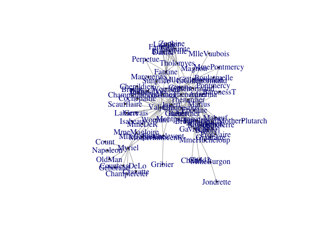

```r
library(SOMbrero)
data(lesmis)
summary(lesmis)
```

```
## IGRAPH 3babff7 U--- 77 254 -- 
## + attr: layout (g/n), id (v/n), label (v/c), value (e/n)
```

```r
plot(lesmis,vertex.size=0)
```

<!-- -->


```r
library(networkD3)
src <- c("A", "I", "A", "B",
         "B", "E", "C", "C", 
         "D", "C", "B")

target <- c("B", "C", "F", "J",
            "H", "F", "G", "H", 
            "I", "I", "I")

networkData <- data.frame(src, target)

# Plot
simpleNetwork(networkData, 
              nodeColour = "red", 
              #nodeClickColour="blue",
              zoom=T,
              height=300,
              width=300, 
              fontSize = 16)
```

<!--html_preserve--><div id="htmlwidget-8f6255d4034b9edecb79" style="width:672px;height:480px;" class="forceNetwork html-widget"></div>
<script type="application/json" data-for="htmlwidget-8f6255d4034b9edecb79">{"x":{"links":{"source":[0,8,0,1,1,4,2,2,3,2,1],"target":[1,2,5,9,7,5,6,7,8,8,8],"value":[1,1,1,1,1,1,1,1,1,1,1],"colour":["#666","#666","#666","#666","#666","#666","#666","#666","#666","#666","#666"]},"nodes":{"name":["A","B","C","D","E","F","G","H","I","J"],"group":[1,1,1,1,1,1,1,1,1,1],"nodesize":[8,8,8,8,8,8,8,8,8,8]},"options":{"NodeID":"name","Group":"group","colourScale":"d3.scaleOrdinal(['red'])","fontSize":16,"fontFamily":"serif","clickTextSize":40,"linkDistance":50,"linkWidth":"'1.5px'.toString()","charge":-30,"opacity":0.6,"zoom":true,"legend":false,"arrows":false,"nodesize":true,"radiusCalculation":"d.nodesize","bounded":false,"opacityNoHover":1,"clickAction":null}},"evals":[],"jsHooks":[]}</script><!--/html_preserve-->


```r
library(igraph)
library(dplyr)
library(ggplot2)

# Read in CSV files with edge and node attributes
original_edgelist <- read.csv("data/les_mis_edges.csv", stringsAsFactors = FALSE)
#original_nodelist <- read.csv("goltzius_nodes.csv", stringsAsFactors = FALSE)
```

