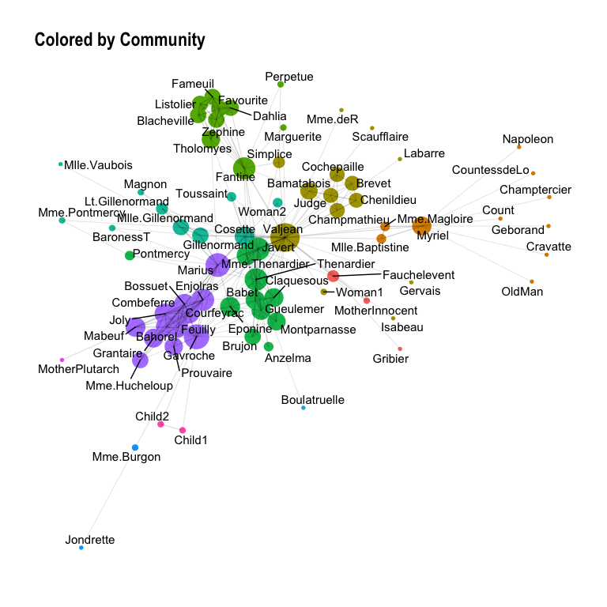
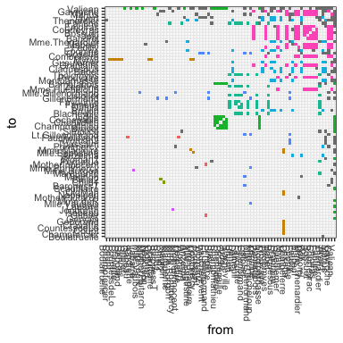
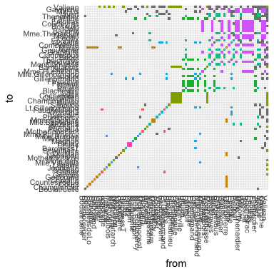
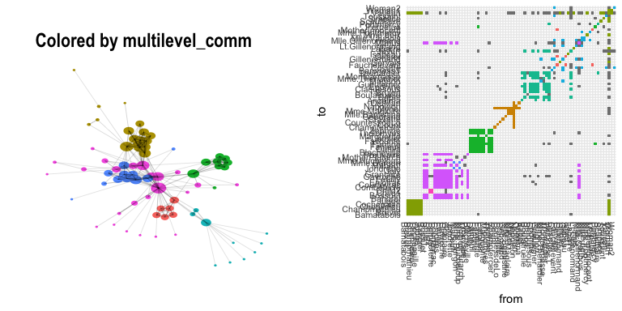
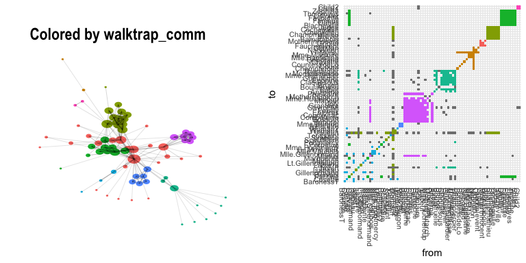

Post 1: Analyzing Co-Occurance Networks of Les Misérables Characters
================

Objective
=========

In this post, I will go through a graph problem called "Community Detection". Community detection is a very important problem in the area of graph theory and social networking.

Data
====

For ease of understanding I will use a relatively smalle

``` r
library(tidyverse)
library(igraph)
library(statnet)
library(tidygraph)
library(ggraph)

library(igraph)
library(dplyr)
library(ggplot2)
library(plyr)
```

``` r
original_vertices <- read.csv("data/les_mis_vertices.csv", stringsAsFactors = FALSE)
original_edgelist <- read.csv("data/les_mis_edges.csv", stringsAsFactors = FALSE)

names <- unique(c(original_edgelist$from, original_edgelist$to))

g <- graph_from_data_frame(d=original_edgelist, vertices = original_vertices, directed=TRUE)

V(g)$Degree <- centralization.degree(g)$res
V(g)$Betweenness <- centralization.betweenness(g)$res
V(g)$Community <- paste0("C",V(g)$Community)
V(g)$Group <- V(g)$Community

V(g)$r <- log(V(g)$Degree)/12 #Radius of node Just for visualization purpose
```



``` r
node_list <- get.data.frame(g, what = "vertices")

all_nodes <- sort(node_list$name)

edge_list <- get.data.frame(g, what = "edges") %>%
  inner_join(node_list %>% select(name, Community), by = c("from" = "name")) %>%
  inner_join(node_list %>% select(name, Community), by = c("to" = "name")) %>%
  mutate(group = ifelse(Community.x == Community.y, Community.x, NA) %>% factor())

plot_data <- edge_list %>% mutate(to = factor(to, levels = all_nodes), from = factor(from, levels = all_nodes))
```



    ## Warning in edge.betweenness.community(g): At community.c:460 :Membership
    ## vector will be selected based on the lowest modularity score.

    ## Warning in edge.betweenness.community(g): At community.c:467 :Modularity
    ## calculation with weighted edge betweenness community detection might not
    ## make sense -- modularity treats edge weights as similarities while edge
    ## betwenness treats them as distances







``` r
plot_graph(g, "infomap_comm")
```


