Post 2: Exploratory Data Analysis of Gun Violence in the USA
================

Objective
=========

This post is intended to be an introductory exploratory data analysis. In this case, we analyze the gun violence issue in the USA. We want to see how the gun violence data looks like and what insights can we get. We will perform temporal analysis (when the gun violences occur), spatial (where does those occur), along with some other analysis. The data size is quite big, so it may take a while to run all the code I described here. The total data is collected from Kaggle and found in this link: <https://www.kaggle.com/jameslko/gun-violence-data/discussion/55307>

First let us load some packages.

``` r
library(tidyverse)
library(statnet)
library(tidygraph)
library(ggraph)
library(igraph)
library(dplyr)
library(plyr)
library(data.table)
library(lubridate)
require(maps)
library(tm)
library(SnowballC)
library(wordcloud)
library(RColorBrewer)
library(albersusa)
library(sf)
library(sp)
library(rgeos)
library(maptools)
library(ggplot2)
library(ggalt)
library(ggthemes)
library(viridis)
library(scales)
```

Initial Data Loading
--------------------

We first load the data, convert date column into R Date. We further breakdown the date into Year, Month, Day, Day of Week, Day of Year. You may notice that I used *fread* instead of *read.csv*. Typically, when working with huge datasets, I found it way faster than the read.csv. Furthermode, data.table is often quite faster than data.frame. Therefore, you can consider data.table for huge datasets.

``` r
gun_violence <- fread("data/gun-violence-data_01-2013_03-2018.csv")
gun_violence$date <- as.Date(gun_violence$date)

gun_violence$Year <- year(gun_violence$date)
gun_violence$Month <- month(gun_violence$date)
gun_violence$Day <- day(gun_violence$date)
gun_violence$DayOfWeek <- weekdays(gun_violence$date)
gun_violence$DayOfYear <- as.numeric(format(gun_violence$date, "%j"))
```

Temporal Analysis
=================

We begin to look into the data \* Lets take a look into the distribution of data by year. Clearly, 2013 is under reported. Therefore, we remove the data belonging to this year.

``` r
table(gun_violence$Year)
```

    ## 
    ##  2013  2014  2015  2016  2017  2018 
    ##   278 51854 53579 58763 61401 13802

``` r
gun_violence <- gun_violence[gun_violence$Year>2013,]
```

Gun violence incidents, injuries, and deaths per year
-----------------------------------------------------

Lets look into the number of incidents, injuries, and deaths per year due to gun violence.

``` r
dt <- gun_violence[, .(TotalReport = .N, TotalDeath = sum(n_killed), TotalInjured = sum(n_injured)), by=list(Year)]

dt.wide <- melt(dt, measure.vars = c("TotalReport", "TotalInjured", "TotalDeath"), id.vars = c("Year"), variable.name = "Statistic", "Count")

ggplot(data=dt.wide, aes(x=Year, y=Count, fill=Statistic)) + theme_fivethirtyeight() + geom_bar(stat="identity", position = "dodge") + scale_fill_discrete("") + scale_y_continuous("Count")
```

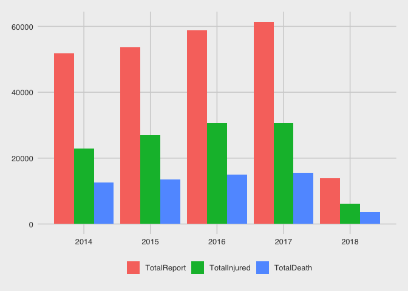 \* From the above figure, we can clearly see that gun violence along with number of injuries and deaths are rising since year 2014 (discarding incomplete 2018's data), which is really alarming.

Average number of incidents per month
-------------------------------------

Now we investigate the average number of incidents group by month. The idea is to determine which month has the most number of incidents.

``` r
dt <- gun_violence[, .(Report = .N, nMonths=uniqueN(Year), Death = sum(n_killed), Injured = sum(n_injured)), by=list(Month)]

dt$Report <- dt$Report/dt$nMonths
dt$Death <- dt$Death/dt$nMonths
dt$Injured <- dt$Injured/dt$nMonths

avg = mean(dt$Report)

dt.wide <- melt(dt, measure.vars = c("Report", "Injured", "Death"), id.vars = c("Month"), variable.name = "Statistic", "Count")

ggplot(data=dt.wide, aes(x=Month, y=Count, fill=Statistic)) + theme_fivethirtyeight() + geom_bar(stat="identity", position = "dodge") + scale_fill_discrete("") + scale_x_continuous(breaks =1:12, labels=1:12) + scale_y_continuous("") + geom_abline(slope=0, intercept = avg, linetype=2) + ggplot2::annotate("text", x = 2, y = avg+200, label = "Avg. # of Report per Month")
```

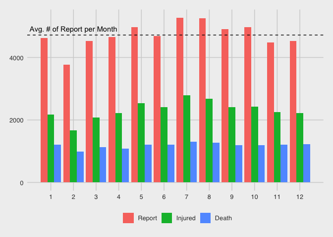

-   Looks like the month of July and August are the most deadly month for gun violence.

Average number of incidents per Week Days
-----------------------------------------

Now lets move into how the number looks like per weekday.

``` r
dt <- gun_violence[, .(Report = .N, nDayOfWeek=uniqueN(date), Death = sum(n_killed), Injured = sum(n_injured)), by=list(DayOfWeek)]

dt$DayOfWeek <- factor(dt$DayOfWeek, levels = c("Monday", "Tuesday", "Wednesday", "Thursday", "Friday", "Saturday", "Sunday"))

dt$Report <- dt$Report/dt$nDayOfWeek
dt$Death <- dt$Death/dt$nDayOfWeek
dt$Injured <- dt$Injured/dt$nDayOfWeek

avg = mean(dt$Report)
avg_deaths_per_day = mean(dt$Death)

dt.wide <- melt(dt, measure.vars = c("Report", "Injured", "Death"), id.vars = c("DayOfWeek"), variable.name = "Statistic", "Count")

ggplot(data=dt.wide, aes(x=DayOfWeek, y=Count, fill=Statistic)) + theme_fivethirtyeight() + geom_bar(stat="identity", position = "dodge") + scale_fill_discrete("") + scale_x_discrete("") + scale_y_continuous("") + geom_abline(slope = 0, intercept = avg, linetype=2) + ggplot2::annotate("text", x = 3, y = avg+5, label = "Avg. # of Report per Day")
```

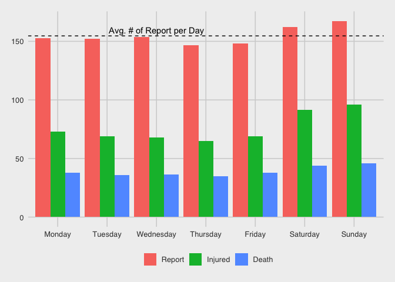

-   Saturday and Sunday seem to be the most deadly days of week.
-   On average, we see 155 gun violences per day which is very alarming statistic.
-   We lose 39 lives per day due to gun violence.

Time series data
----------------

Next we investigate whether there is seasonality in the data. We will divide the data by year and figure out whether the similar trend occurs in each year.

``` r
dt <- gun_violence[, .(Report = .N), by=list(Year, DayOfYear)]

ggplot(data=dt, aes(x=DayOfYear, y=Report, shape=factor(Year), color=factor(Year))) + theme_fivethirtyeight() + geom_line() + geom_point() + scale_color_discrete("Year") + scale_shape("Year") + geom_smooth()
```

    ## `geom_smooth()` using method = 'loess' and formula 'y ~ x'

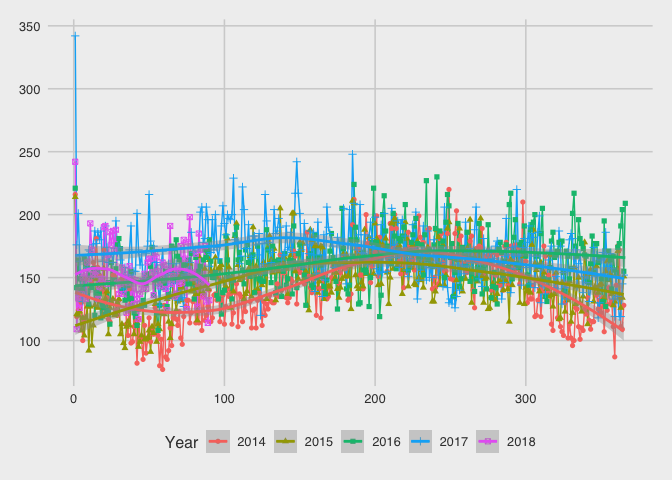

-   It looks like there is seasonality in the gun violence reports. The same trend repeats in yeach year.
-   However, the number of incidents are increasing year by year.

The most dangerous date?
------------------------

We now investigate which dates have the most number of incidents reported.

``` r
dt <- gun_violence[Year!=2018 , .(Report = .N), by=list(Month, Day)]

dt[order(-rank(Report))][1:5,]
```

    ##    Month Day Report
    ## 1:     1   1    993
    ## 2:     7   4    875
    ## 3:     7   5    820
    ## 4:     7  30    788
    ## 5:    10  25    742

-   Looks like, New Year and 4th of July is some of the deadliest days over the years. We can investigate whether the same pattern occurs in all other holidays as a future work.

Spatial Analysis
================

Now, we perform spatial analysis of the data. We will investigate how the incidents are reported in each states in the USA.

Number of Incidents per State
-----------------------------

First, we show the number of incidents per State. We use USA map and color to visualize this.

``` r
us <- usa_composite()
us_map <- fortify(us, region="name")

gg <- ggplot()
gg <- gg + geom_map(data=us_map, map=us_map,
                    aes(x=long, y=lat, map_id=id),
                    color="#2b2b2b", size=0.1, fill=NA)
gg <- gg + theme_map()

dataset <- gun_violence[, .(Report = .N), by=list(state)]

gg + geom_map(data=dataset, map=us_map, aes(fill=Report, map_id=state), color="white", size=0.1) +
  coord_proj(us_laea_proj) +
  scale_fill_viridis(name="Total Number of Reports", labels=comma) +
  theme(legend.position="top", legend.key.width=unit(3, "lines"))
```

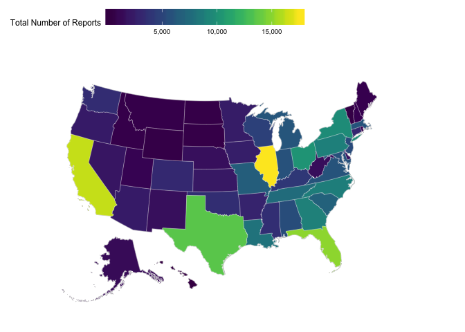 \* From the above map, Illinoies State has the highest number of gun violence incidents reported in last 5 years, the number is equal to 17,538. It is followed by California with 16267 incidents reported, followed by Florida with 15,016 incidents and Texas with 13,566 gun violence incidents.

-   However, this might not give the complete picture. The number of incidents could be just large as these states are highly populated. Next, I have explored the number of incidents 100,000 people on each state. I used 2014 US population data for this analysis.

``` r
us <- usa_composite()
us_map <- fortify(us, region="name")

dt2 <- merge(dataset, us@data[,c("name", "pop_2014")], by.x="state", by.y="name")
dt2$IncidentsPer100K <- dt2$Report/dt2$pop_2014*100000

gg <- ggplot()
gg <- gg + geom_map(data=us_map, map=us_map,
                    aes(x=long, y=lat, map_id=id),
                    color="#2b2b2b", size=0.1, fill=NA)
gg <- gg + theme_map()
gg + geom_map(data=dt2, map=us_map,
           aes(fill=IncidentsPer100K, map_id=state),
           color="white", size=0.1) +
  coord_proj(us_laea_proj) +
  scale_fill_viridis(name="# of Reports per 100K", labels=comma) +
  theme(legend.position="top", 
        legend.key.width=unit(3, "lines"))
```

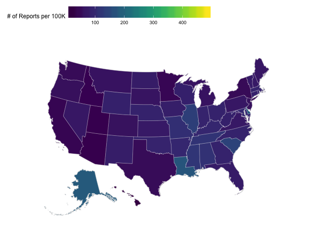

``` r
#dt3 <- dt2[order(-rank(IncidentsPer10K), state)]
dt3 <- transform(dt2, state=reorder(state, -IncidentsPer100K) ) 
ggplot(dt3, aes(x=state,y=IncidentsPer100K,fill=IncidentsPer100K)) + theme_fivethirtyeight() + 
  scale_fill_gradient("# of Reports per 100K",low="blue", high="red") + geom_bar(stat = "identity") + theme(axis.text.x = element_text(angle = 270, hjust = 0))
```

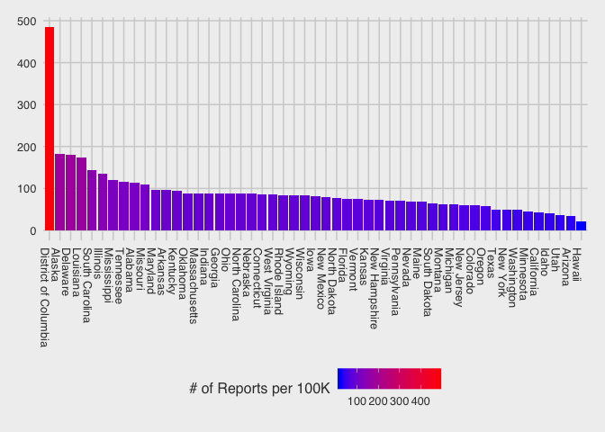

-   Therefore, District of Columbia has seen the highest level of gun violence per capita. Note that Illinois is still placed in the top 10, however Texas, California are in bottom 10. Therefore, we need to be careful before drawing conclusion.

Violence per City
=================

Next, lets look how the numbers look like in major cities. As many city names are repeated, I used state abbreviation along with city name for disambiguiition.

``` r
gun_violence2 <- merge(gun_violence, data.frame(state=state.name, stateabb=state.abb), by.x="state", by.y="state")
gun_violence2$CityState <- paste(gun_violence2$city_or_county, gun_violence2$stateabb)

dataset <- gun_violence2[, .(Report = .N), by=list(CityState)]
dt2 <- merge(dataset, us.cities[,c("name", "pop")], by.x="CityState", by.y="name")
dt2$IncidentsPer100K <- dt2$Report/dt2$pop*100000

dt3 <- dt2[order(-rank(IncidentsPer100K), CityState)][1:50,]
dt3 <- transform(dt3, CityState=reorder(CityState, -IncidentsPer100K))

ggplot(dt3, aes(x=CityState,y=IncidentsPer100K,fill=IncidentsPer100K)) + theme_fivethirtyeight() + 
  scale_fill_gradient("# of Reports per 100K",low="blue", high="red") + geom_bar(stat = "identity") + theme(axis.text.x = element_text(angle = 270, hjust = 0))
```

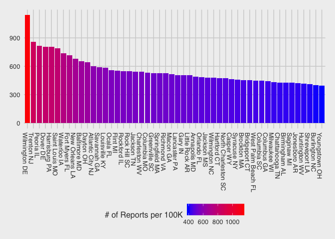

-   Looks like Wilmington DE has the most number of incidents reported per 100K population.

Where do all these incidents happen
===================================

Lets investigate where all these gun violence takes place. The location\_description field has the description of the place where the incidents take place. Therefore, we will analyze these descriptions. We will use text mining tools to do that. For ease of representation, we will use word cloud for visualizing the data. I have used top 200 words after some cleanup.

``` r
docs <- Corpus(VectorSource(gun_violence$location_description))
toSpace <- content_transformer(function (x , pattern ) gsub(pattern, " ", x))
docs <- tm_map(docs, toSpace, "/")
docs <- tm_map(docs, toSpace, "@")
docs <- tm_map(docs, toSpace, "\\|")
docs <- tm_map(docs, content_transformer(tolower))
docs <- tm_map(docs, removeNumbers)
docs <- tm_map(docs, removeWords, stopwords("english"))
docs <- tm_map(docs, removePunctuation)
docs <- tm_map(docs, stripWhitespace)
dtm <- TermDocumentMatrix(docs)
m <- as.matrix(dtm)
v <- sort(rowSums(m),decreasing=TRUE)
d <- data.frame(word = names(v),freq=v)

set.seed(1234)
wordcloud(words = d$word, freq = d$freq, min.freq = 1, max.words=200, random.order=FALSE, rot.per=0.35, colors=brewer.pal(8, "Dark2"))
```

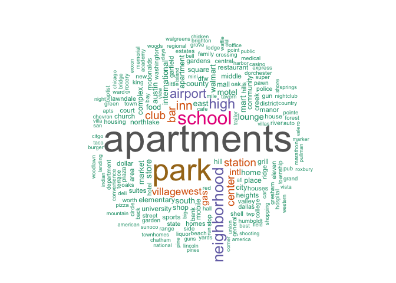

-   It looks like most gun violence takes place in apartments. Park, schoold, neighborhood etc are also frequent targets.

Other Aspects
=============

Lets move into some other aspects of gun violence.

Number of Guns
--------------

First we observe the number of guns involved.

``` r
gun_violence$n_guns_involved <- as.numeric(gun_violence$n_guns_involved)
as.data.frame(table(gun_violence$n_guns_involved))
```

    ##     Var1   Freq
    ## 1      1 127464
    ## 2      2   7465
    ## 3      3   2018
    ## 4      4    870
    ## 5      5    435
    ## 6      6    285
    ## 7      7    232
    ## 8      8    137
    ## 9      9    111
    ## 10    10    103
    ## 11    11     67
    ## 12    12     93
    ## 13    13     67
    ## 14    14     53
    ## 15    15     54
    ## 16    16     41
    ## 17    17     56
    ## 18    18     34
    ## 19    19     25
    ## 20    20     48
    ## 21    21     25
    ## 22    22     31
    ## 23    23     22
    ## 24    24     18
    ## 25    25     31
    ## 26    26     17
    ## 27    27     21
    ## 28    28     14
    ## 29    29     11
    ## 30    30     36
    ## 31    31     11
    ## 32    32      9
    ## 33    33      2
    ## 34    34     12
    ## 35    35     13
    ## 36    36     10
    ## 37    37      4
    ## 38    38      6
    ## 39    39     11
    ## 40    40     18
    ## 41    41     10
    ## 42    42      3
    ## 43    43      6
    ## 44    44      3
    ## 45    45      7
    ## 46    46      5
    ## 47    47      3
    ## 48    48      9
    ## 49    49      2
    ## 50    50     23
    ## 51    52      2
    ## 52    53      1
    ## 53    55      1
    ## 54    59      1
    ## 55    60      1
    ## 56    62      1
    ## 57    66      1
    ## 58    67      1
    ## 59    68      3
    ## 60    70      2
    ## 61    72      1
    ## 62    73      2
    ## 63    76      1
    ## 64    80      1
    ## 65    81      2
    ## 66    82      2
    ## 67    83      1
    ## 68    84      1
    ## 69    85      1
    ## 70    89      1
    ## 71    90      1
    ## 72    91      1
    ## 73    96      1
    ## 74    97      1
    ## 75    98      1
    ## 76    99      1
    ## 77   100      5
    ## 78   103      1
    ## 79   107      1
    ## 80   111      1
    ## 81   112      1
    ## 82   114      1
    ## 83   115      1
    ## 84   127      1
    ## 85   130      1
    ## 86   138      3
    ## 87   145      1
    ## 88   151      1
    ## 89   152      1
    ## 90   158      1
    ## 91   170      1
    ## 92   183      1
    ## 93   189      1
    ## 94   191      1
    ## 95   200      2
    ## 96   225      1
    ## 97   268      1
    ## 98   276      1
    ## 99   280      1
    ## 100  300      3
    ## 101  323      1
    ## 102  338      1
    ## 103  346      1
    ## 104  374      1
    ## 105  399      1
    ## 106  400      4

``` r
ggplot(gun_violence, aes(x=n_guns_involved, color=Year, fill=Year)) + 
  geom_histogram(color="#e41a1c", fill="#fbb4ae") + theme_minimal() + theme(legend.position="top") + scale_x_continuous(trans = log10_trans()) + scale_y_continuous("# of Incidents")
```

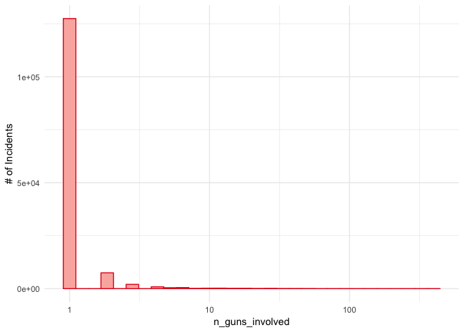

-   As seen from the figure, most of the incidents have only one or two guns. Therefore, only one gun is enough to do the damage.

Types of guns
-------------

Lets see which types of guns are typically used.

``` r
gun_type <- unlist(strsplit(gun_violence$gun_type, "||", fixed = T))
ll <- length(gun_type)
gun_type <- unlist(strsplit(gun_type, "::", fixed = T))[(1:ll)*2]
sort(table(gun_type), decreasing = T)[1:20]
```

    ## gun_type
    ##         Unknown         Handgun             9mm           Rifle 
    ##          130789           25019            6436            5268 
    ##         Shotgun           22 LR           40 SW        380 Auto 
    ##            4257            3342            2737            2391 
    ##         45 Auto          38 Spl 223 Rem [AR-15]        12 gauge 
    ##            2356            1808            1610            1111 
    ##           Other    7.62 [AK-47]         357 Mag         25 Auto 
    ##            1058             934             822             610 
    ##         32 Auto        20 gauge          44 Mag       0:Unknown 
    ##             487             205             194             142

-   From the table of data, it is clear than Handgun, 9mm, and Rifle are the most dangerous known guns that were used.
-   Quite a large number of reports does not mention gun type.

Incident Characteristics
------------------------

Next, we investigate the characteristics of the incidents.

``` r
incident_characteristics <- gun_violence$incident_characteristics[!is.na(gun_violence$incident_characteristics)] 

library(stringr)

incidents <- strsplit(incident_characteristics, "|", fixed = T)

incidents_plain <- unlist(incidents)
incidents_plain <- incidents_plain[incidents_plain!=""]
incidents_plain <- incidents_plain[incidents_plain!="NAV"]

sort(table(incidents_plain), decreasing = T)[1:10]
```

    ## incidents_plain
    ##                                       Shot - Wounded/Injured 
    ##                                                        93676 
    ##                    Shot - Dead (murder, accidental, suicide) 
    ##                                                        53253 
    ##                                        Non-Shooting Incident 
    ##                                                        44837 
    ##                                    Shots Fired - No Injuries 
    ##                                                        35749 
    ##  Possession (gun(s) found during commission of other crimes) 
    ##                                                        30858 
    ## Armed robbery with injury/death and/or evidence of DGU found 
    ##                                                        19716 
    ##                Brandishing/flourishing/open carry/lost/found 
    ##                                                        19017 
    ##                              ATF/LE Confiscation/Raid/Arrest 
    ##                                                        17991 
    ##                                    Officer Involved Incident 
    ##                                                        17975 
    ##              Possession of gun by felon or prohibited person 
    ##                                                        17141

-   In most cases, the gun violence have shots fired and some people die. There are also many cases where no shoorting occurs. The table above lists the 10 most frequent incidents.

Demographics
------------

Now we move into the demographics of the incidents. The following code investigates the participant\_type, participant\_age, and participant\_gender. Note that the code takes a while to run as this have to be processed for very large size data.

``` r
participant_type <- strsplit(gun_violence$participant_type[!is.na(gun_violence$participant_type)], "||", fixed = T)
participant_age <- strsplit(gun_violence$participant_age[!is.na(gun_violence$participant_age)], "||", fixed = T)
participant_gender <- strsplit(gun_violence$participant_gender[!is.na(gun_violence$participant_gender)], "||", fixed = T)

participants <- data.frame(Type=c(),Age=c(),Gender=c(),Date=c())

lst <- list()

j <- 1

#i <- 692
for (i in seq_along(participant_type)) {
  
  if(i%%10000==0){
    print(i/nrow(gun_violence)*100)
    print(Sys.time())
    
    lst[[j]] <- participants
    participants <- data.frame(Type=c(),Age=c(),Gender=c(),Date=c())
    j <- j + 1
  }
  
  llt <- length(participant_type[[i]])
  
  df <- NULL
  if(llt>0) {
    pt <- unlist(strsplit(participant_type[[i]], "::", fixed = T))
    df_pt <- data.frame(ID=pt[((1:llt)*2 -1)], Type=pt[(1:llt)*2])
    df <- df_pt
  }
  else{
    next
  }
  
  lla <- length(participant_age[[i]])
  if(lla>0){
    pa <- unlist(strsplit(participant_age[[i]], "::", fixed = T))
    df_pa = data.frame(ID=pa[((1:lla)*2 -1)], Age=pa[(1:lla)*2])
    df <- merge(df_pt, df_pa, by="ID", all.x = T)
  }else{
    df$Age <- NA
  }
  
  llg <- length(participant_gender[[i]])
  if(llg>0){
    pg <- unlist(strsplit(participant_gender[[i]], "::", fixed = T))
    df_pg <- data.frame(ID=pg[((1:llg)*2 -1)], Gender=pg[(1:llg)*2])
    df <- merge(df, df_pg, by="ID", all.x = T)  
  }else{
    df$Gender <- NA
  }
  
  df$Date <- gun_violence$date[i]
  if(nrow(participants)==0){
    participants <- df[2:5]
  } else {
    participants <- rbind(participants, df[,2:5])
  }
}
```

    ## [1] 4.177127
    ## [1] "2018-12-11 13:38:58 EST"
    ## [1] 8.354254
    ## [1] "2018-12-11 13:39:45 EST"
    ## [1] 12.53138
    ## [1] "2018-12-11 13:40:45 EST"
    ## [1] 16.70851
    ## [1] "2018-12-11 13:41:38 EST"
    ## [1] 20.88563
    ## [1] "2018-12-11 13:42:27 EST"
    ## [1] 25.06276
    ## [1] "2018-12-11 13:43:18 EST"
    ## [1] 29.23989
    ## [1] "2018-12-11 13:43:58 EST"
    ## [1] 33.41702
    ## [1] "2018-12-11 13:44:31 EST"
    ## [1] 37.59414
    ## [1] "2018-12-11 13:45:11 EST"
    ## [1] 41.77127
    ## [1] "2018-12-11 13:45:51 EST"
    ## [1] 45.9484
    ## [1] "2018-12-11 13:46:26 EST"
    ## [1] 50.12552
    ## [1] "2018-12-11 13:46:58 EST"
    ## [1] 54.30265
    ## [1] "2018-12-11 13:47:39 EST"
    ## [1] 58.47978
    ## [1] "2018-12-11 13:48:23 EST"
    ## [1] 62.6569
    ## [1] "2018-12-11 13:49:05 EST"
    ## [1] 66.83403
    ## [1] "2018-12-11 13:49:40 EST"
    ## [1] 71.01116
    ## [1] "2018-12-11 13:50:23 EST"
    ## [1] 75.18828
    ## [1] "2018-12-11 13:51:02 EST"
    ## [1] 79.36541
    ## [1] "2018-12-11 13:51:39 EST"
    ## [1] 83.54254
    ## [1] "2018-12-11 13:52:19 EST"
    ## [1] 87.71966
    ## [1] "2018-12-11 13:52:53 EST"
    ## [1] 91.89679
    ## [1] "2018-12-11 13:53:31 EST"
    ## [1] 96.07392
    ## [1] "2018-12-11 13:54:11 EST"

``` r
participants <- ldply(lst, data.frame)
```

``` r
participants$Age <- as.numeric(participants$Age)
participants_dt <- data.table(participants)
```

The summary of demographics is shown below.

``` r
dt4 <- participants_dt[,.(AvgAge=mean(Age, na.rm = T),nParticipants=.N),by=list(Type, Gender)]

ggplot(dt4, aes(x=Type,y=nParticipants,fill=Gender)) + theme_fivethirtyeight() + geom_bar(stat = "identity", position = position_dodge()) + theme(axis.text.x = element_text(angle = 270, hjust = 0)) + ggtitle("Number of People by Gender")
```

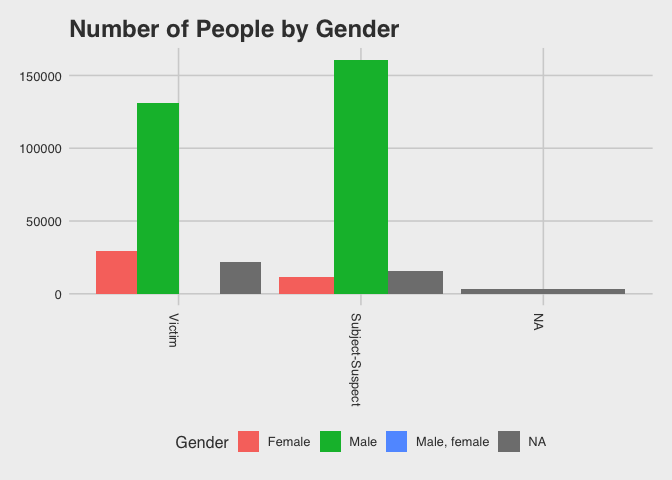

``` r
ggplot(dt4, aes(x=Type,y=AvgAge,fill=Gender)) + theme_fivethirtyeight() + geom_bar(stat = "identity", position = position_dodge()) + theme(axis.text.x = element_text(angle = 270, hjust = 0)) + ggtitle("Mean Age of People by Gender")
```

    ## Warning: Removed 1 rows containing missing values (geom_bar).

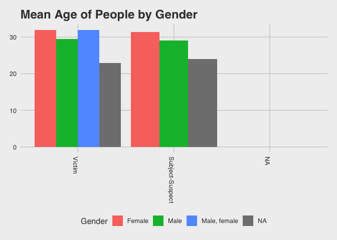

Now we show the distribution of Suspect and Victim's age.

``` r
ggplot(participants[participants$Type=="Subject-Suspect",], aes(x=Age, color=Type, fill=Type)) + 
  geom_histogram(color="#e41a1c", fill="#fbb4ae") + theme_minimal()+theme(legend.position="top") + scale_y_continuous("# of Suspects") + ggtitle("Suspects")
```

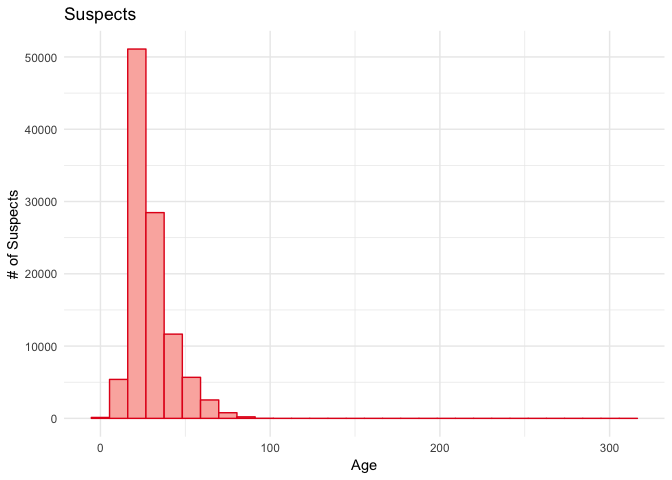

``` r
ggplot(participants[participants$Type=="Victim",], aes(x=Age, color=Type, fill=Type)) + 
  geom_histogram(color="#4daf4a", fill="#ccebc5") + theme_minimal()+theme(legend.position="top") + scale_y_continuous("# of Victimes") + ggtitle("Victims")
```

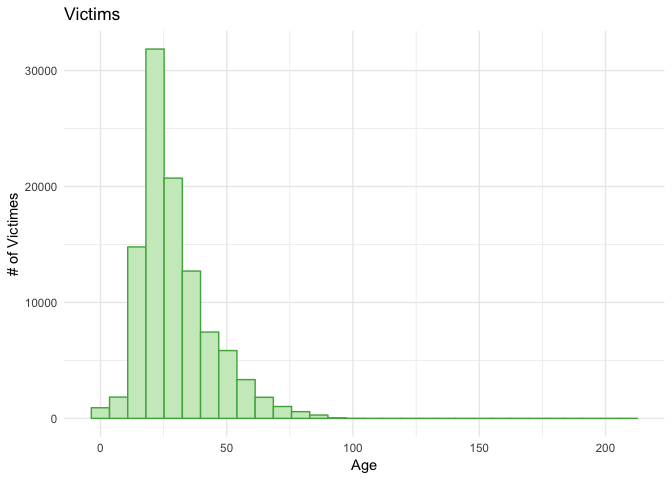

Conclusion
==========

We investigated the gun violence in the USA from several prospects. It seems to be very concerning situation. The exploratory analysis gives a glimpse of the situation. A further in-depth analysis with related gun-laws, regulations, income, rents, etc. will help us better understand the situation.
